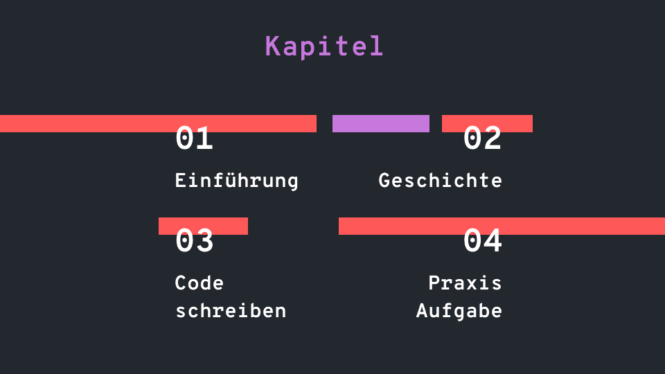

[Gross](./README.md)

   

<h1 align="center">
   pWest - Programmieren
</h1>

   Yannic Studer

<!-- HEAD -->

## Hallo Welt
Willkommen im GitHub-Repository pWest! Dieses Repository bietet eine Sammlung von Folien und Aufgaben die dazu beitragen sollen, Grundlagen der Informatik und des Programmierens für Neuling zugänglich und verständlich zu machen. Die Aufgaben und Übungen sind so konzipiert, dass sie die Kreativität und das logische Denken der Schüler fördern und ihnen helfen, die grundlegenden Konzepte der Informatik zu verstehen. Ich hoffen, dass dieses Repository für Lehrer, Eltern und Schüler gleichermassen nützlich sein wird und ich freue mich, von Ihren Erfahrungen und Rückmeldungen zu hören.

Viel Spass beim Entdecken und Lernen!

## Inhalt

   

- ### [Einführung](./einfuehrung.md)
> In diesem Kapitel werden die grundlegenden Konzepte der Informatik und des Programmierens erläutert
- ### [Geschichte](./geschichte.md)
> In diesem Kapitel werden ein paar interessante geschichtliche Ereignisse behandelt
- ### [Code schreiben](./code.md)
> In diesem Kapitel werden die Schüler Schritt für Schritt durch die Grundlagen des Schreibens von HTML, CSS und JavaScript geführt.
- ### [Praxis Aufgabe](./aufgabe.md)
> In diesem Kapitel werden die Schüler aufgefordert, das Gelernte in die Praxis anhand einer Aufgabe umzusetzen.

## Lizenz
Projekt ist [MIT](./LICENSE) lizenziert

 
 
 

[Zum nächsten Kapitel?](./einfuehrung.md)