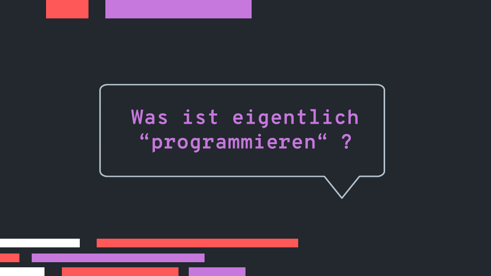
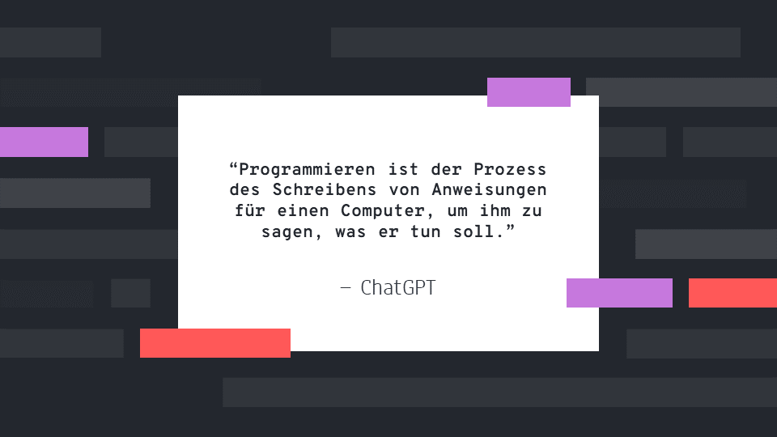
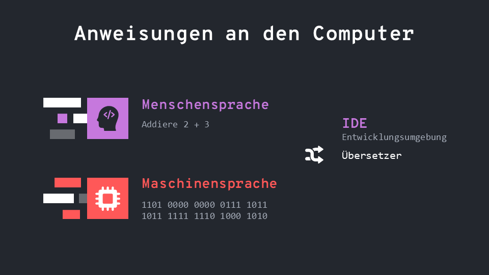
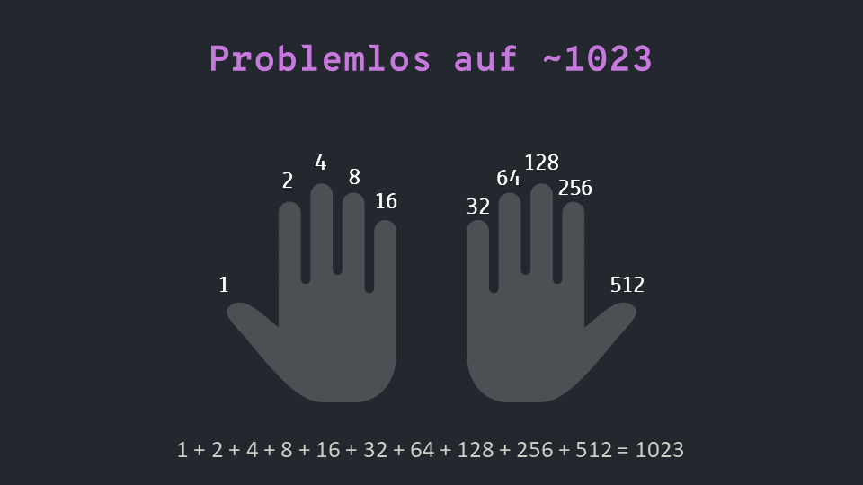
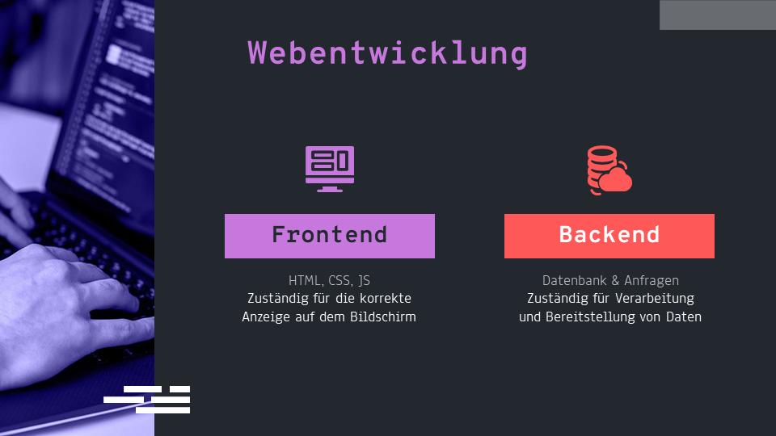

[Zurück](./README.md)

   

<h1 align="center">
   pWest - Programmieren
</h1>

   Yannic Studer

## Einführung

   

### Hello World

Willkommen in der Welt der Programmierung! In diesem Dokument werden ihr mit den Grundlagen der Computerprogrammierung Bekanntschaft machen.

   

### Was ist Programmieren?

Programmieren ist der Prozess der Erstellung von Anweisungen, die ein Computer ausführen soll. Diese Anweisungen, die auch als Code bezeichnet werden, werden in einer bestimmten Programmiersprache geschrieben. Es gibt viele verschiedene Programmiersprachen, von denen jede ihre eigenen Stärken und Schwächen hat. Um einen einfach Einstieg zu haben werden wir nur mit JavaScript arbeiten. In diesem Dokument werden wir uns auf die Konzepte und Prinzipien konzentrieren, die allen Programmiersprachen gemeinsam sind.

   

Nach chatGPT (eine KI) ist Programmieren der Prozess des Schreibens von Anweisungen für einen Computer, um ihm zu sagen, was er tun soll. Generell kann ich dieser Interpretation zustimmen, ich würde jedoch ein paar Dinge abändern. Ich finde, Informatiker dienen als Schnittstelle zwischen Mensch und Maschine, also als eine Art Dolmetscher.

   

### Menschen/Maschinen -sprache und IDE's

Menschensprache ist die Sprache, die wir Menschen verwenden, um miteinander zu kommunizieren. Beispielsweise Englisch, Deutsch oder Französisch. Wenn wir programmieren, schreiben wir Anweisungen in einer Programmiersprache, die der Computer verstehen und ausführen kann, aber die für uns Menschen leichter zu lesen und zu verstehen ist als die Maschinensprache.

Maschinensprache ist die Sprache, die direkt von einem Computer verstanden wird. Es besteht aus binären Codes (0 und 1) die direkt in die Hardware des Computers eingespeist werden. Es ist die niedrigste Ebene der Programmiersprache und es ist sehr schwer für Menschen zu lesen und zu schreiben.

Eine IDE (Integrated Development Environment) ist eine Anwendung, die es Entwicklern ermöglicht, Anweisungen in einer Programmiersprache (wie JavaScript, HTML, CSS) zu schreiben, zu testen und zu debuggen. IDE's enthalten meistens Tools wie Syntax-Highlighting, Auto-Vervollständigung und Debugging-Funktionen, die es Entwicklern erleichtern, ihren Code zu schreiben und Fehler zu finden.

   

### Binärsystem

Das Binärsystem (auch Dualsystem genannt) ist ein Zahlensystem, das nur die Ziffern 0 und 1 verwendet. Im Gegensatz dazu verwendet das Dezimalsystem (das Zahlensystem, das wir normalerweise verwenden) die Ziffern 0 bis 9.

Jede Zahl im Binärsystem besteht aus einer Folge von Binärziffern (0 und 1) und jede Binärziffer repräsentiert einen Wert von 2^n, wobei n die Position der Binärziffer von rechts ist. Beispielsweise:

- die Binärziffer "1" an der ersten Position von rechts repräsentiert 2^0 = 1
- die Binärziffer "1" an der zweiten Position von rechts repräsentiert 2^1 = 2
- die Binärziffer "1" an der dritten Position von rechts repräsentiert 2^2 = 4

Zu der Frage: Wie hoch kann man mit seinen Finger zählen?
Mit unseren Fingern können wir eine Dezimalzahl bis zu 10 zählen (da wir 10 Finger haben). Das Binärsystem hingegen hat nur 2 Ziffern (0 und 1) und kann daher nur zwei Zustände repräsentieren (z.B. an/aus, wahr/falsch). Mit einer kombinierung von wahr/flasch bzw 0 und 1 können wir bis auf ~1023 zählen.

   

### Wie funktioniert Google?

Google ist eine Suchmaschine, die dazu verwendet wird, im Internet nach Informationen zu suchen. Wenn Sie in das Suchfeld auf der Google-Startseite einen Begriff oder eine Frage eingeben, durchsucht Google das Internet nach Seiten, die zu Ihrer Anfrage passen.

Google verwendet einen Algorithmus, um die Ergebnisse zu sortieren und anzuzeigen. Dieser Algorithmus bewertet die Relevanz und Qualität der Seiten anhand von Faktoren wie der Häufigkeit von bestimmten Wörtern auf der Seite, der Anzahl der Links von anderen Websites, die auf diese Seite verweisen und vielen anderen Faktoren. Google versucht auch, die Ergebnisse personalisiert anzubieten, das heisst, es berücksichtigt die Suchverläufe und die Suchpräferenzen des Nutzers, um relevantere Ergebnisse zu liefern.

Eine Person ohne Informatikgrundwissen kann sich das so vorstellen, als würde man eine Bibliothek betreten und nach einem bestimmten Buch suchen. Google durchsucht das Internet wie die Bibliothekar die Bücherregale durchsucht und sortiert die Ergebnisse nach Relevanz und das innerhalb von nicht einmal einer Sekunde.

   

### Webentwicklung

Backend und Frontend sind Begriffe, die in der Webentwicklung verwendet werden und die die verschiedenen Aspekte einer Website beschreiben.

Das Backend einer Website bezieht sich auf die Serverseitige Arbeiten. Es umfasst die Programmierung, die dafür sorgt, dass die Website funktioniert und die Daten verarbeitet, die von der Website genutzt werden. Dazu gehören z.B. Datenbanken, Server-Skripte und APIs (Anwendungsprogrammierschnittstellen).

Das Frontend hingegen bezieht sich auf die Clientseitigen Arbeiten. Es umfasst die Gestaltung und die Benutzerfreundlichkeit der Website, die dafür sorgt, dass die Website für den Benutzer gut aussieht und einfach zu bedienen ist. (Dazu gehören z.B. HTML, CSS und JavaScript)

 
 
 

[Zum nächsten Kapitel?](./geschichte.md)