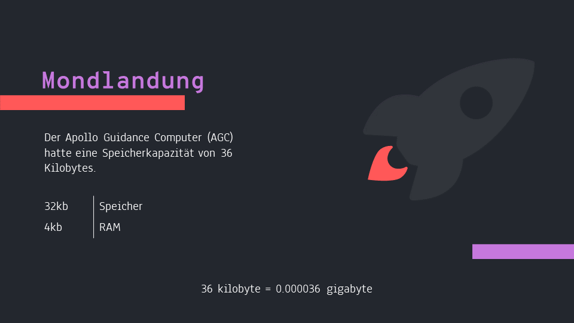
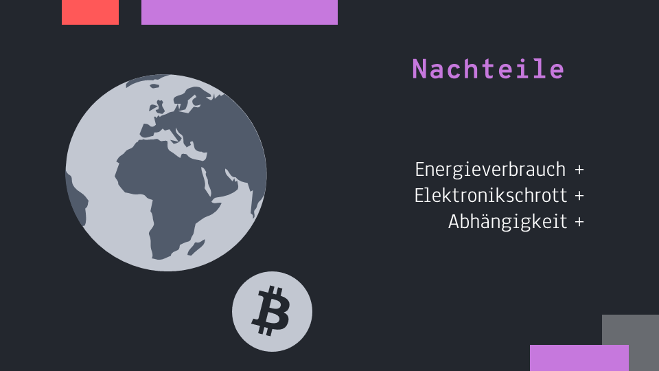

[Zurück](./einfuehrung.md)

   

<h1 align="center">
   pWest - Programmieren
</h1>

   Yannic Studer

## Geschichte

   

### Mondlandung

Die Mondlandung im Jahr 1969 war ein historisches Ereignis, bei dem die Vereinigten Staaten erfolgreich eine Landung auf dem Mond durchführten. Die Technologie, die für diese Mission verwendet wurde, hat sich seitdem stark weiterentwickelt.

In Bezug auf Speichergrösse und Prozessorleistung hat sich die Technologie sehr stark verbessert. Der Computer, der für die Steuerung der Apollo-11-Mission verwendet wurde, hatte eine Speichergrösse von nur 36 Kilobytes und eine Prozessorgeschwindigkeit von 0,043 MHz. Im Vergleich dazu haben moderne Smartphones heutzutage Speichergrössen von mehreren Gigabytes und Prozessoren mit Geschwindigkeiten von mehreren Gigahertz.

Diese Entwicklungen ermöglichten es uns, immer komplexere Aufgaben auszuführen und immer mehr Daten zu speichern. Heute hat man keine, Speicherplatz Probleme mehr, im Gegenteil wurden unsere Programme so komplex das immer stärkere Prozessoren benötigt werden.

   

### Mooresche Gesetz

Das Mooresche Gesetz besagt, dass die Anzahl der Transistoren (eine Art von elektronischen Schaltern) auf einem Computerchip alle 18 bis 24 Monate etwa verdoppelt werden. Dies bedeutet, dass Computerchips immer kleiner und leistungsfähiger werden, was es ermöglicht, mehr Funktionen in einen kleineren und billigeren Chip zu packen.

Ein einfaches Beispiel: Stellen dir vor, du hast eine Schachtel voller Legosteine. Jedes Mal, wenn du die Schachtel öffnest, finden du dort doppelt so viele Legosteine wie zuvor. Das ist ähnlich wie das Mooresche Gesetz, nur dass es sich um Computerchips und Transistoren handelt und nicht um Legosteine.

   

### Nachteile

Einige Umweltnachteile, die durch Programmierung entstehen können, sind:

- Energieverbrauch: Der Betrieb von Computerdatencentern und die Herstellung von Computern und anderen elektronischen Geräten erfordert viel Energie und trägt somit zu einem höheren CO2-Ausstoss bei.

- Elektronikschrott: Computer und andere elektronische Geräte haben eine begrenzte Lebensdauer und werden oft vorzeitig ausgetauscht, was zu einer erhöhten Menge an Elektronikschrott führt.

- Abhängigkeit von Ressourcen: Die Herstellung von Computerchips und elektronischen Geräten erfordert die Verwendung von Ressourcen wie Metalle und Mineralien, die oft in Umweltprobleme wie Abholzung und Bodenzerstörung verwickelt sind.

 
 
 

[Zum nächsten Kapitel?](./code.md)